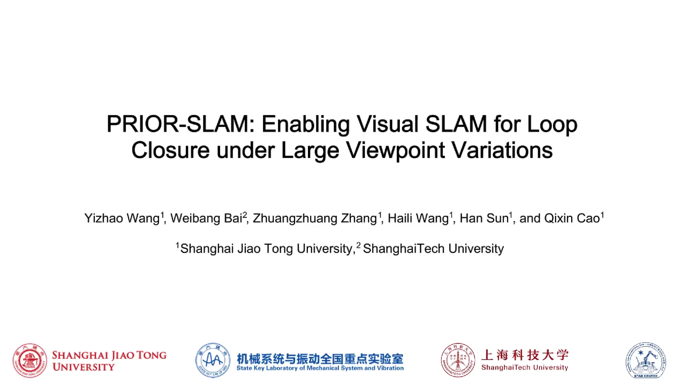
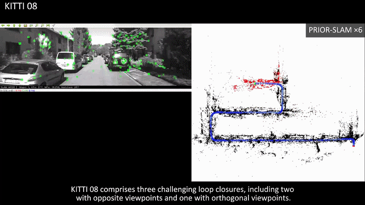
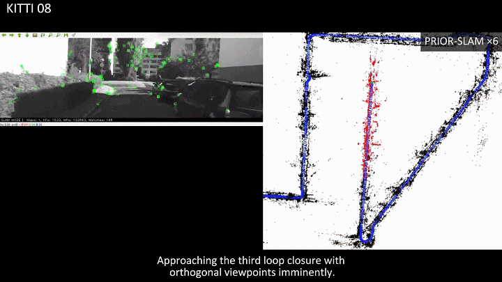
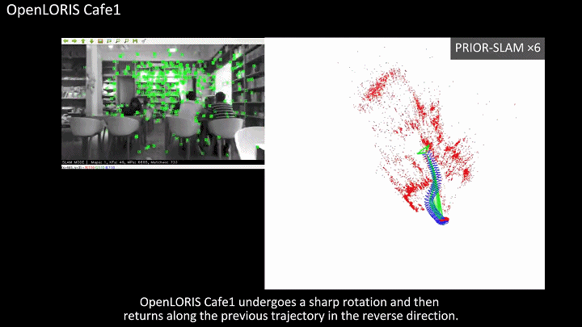
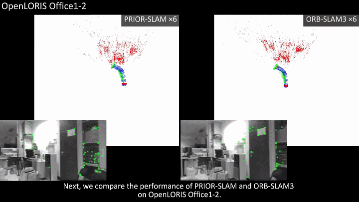
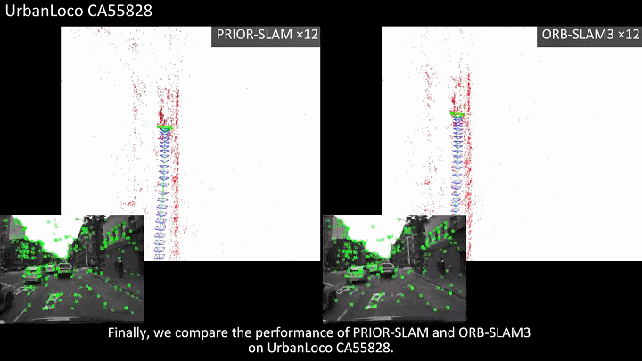

# PRIOR-SLAM
PRIOR-SLAM: Enabling Visual SLAM for Loop Closure under Large Viewpoint Variations

PRIOR-SLAM is the first system which leverages scene structure extracted from monocular input to achieve accurate loop closure under significant viewpoint variations and to be integrated into prevalent SLAM frameworks.

PRIOR-SLAM is developed based on the framework of [ORB-SLAM3](https://github.com/UZ-SLAMLab/ORB_SLAM3) and refines the 3D mesh reconstruction module from [Kimera](https://github.com/MIT-SPARK/Kimera).

We provide demonstrations comparing PRIOR-SLAM with well-known baselines on the selected sequences with challenging loop closures, including [KITTI dataset](https://www.cvlibs.net/datasets/kitti/raw_data.php), [OpenLORIS-Scene dataset](https://github.com/lifelong-robotic-vision/OpenLORIS-Scene/blob/master/download.md), and [UrbanLoco dataset](https://github.com/weisongwen/UrbanLoco/blob/master/README.md).

    

## Loop Closure Demo

### KITTI 08

  

  

### OpenLORIS Cafe1

  

### OpenLORIS Office1-2

  

### UrbanLoco CA55828

  

